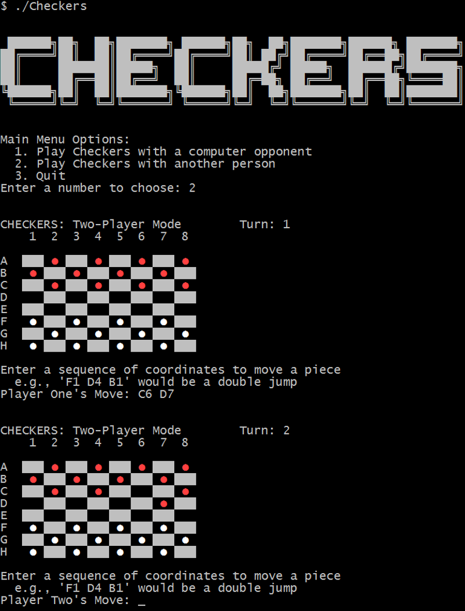

CSCI 3132 - Object-oriented Text-based UI Checkers
==================================================

Copyright 2016 Colin Vandenhof & James Walker

Program Compilation
-------------------

**Required Tools:**

  * make
  * g++
  * Unix-based console that supports ANSI and Unicode

**Compilation and Execution:**

  $ make
  $ ./Checkers.exe

**Program Screenshot from Cygwin**

**Finish Game in 20 Moves**
Move          Effect
C6 D7
F1 E2
C4 D3
E2 C4         Player 1 (Red) Loses Piece
B3 D5         Player 2 (White) Loses Piece
F5 E4
A4 B3
E4 C6 A4      Player 1 (Red) Loses 2 Pieces
C2 D3
A4 C2 E4      Player 1 (Red) Loses 2 Pieces
A6 B5
F7 E8
A2 B3
E8 C6 A4      Player 1 (Red) Loses 2 Pieces
C8 D7
A4 C2         Player 1 (Red) Loses Piece
B1 D3 F5      Player 2 (White) Loses King 2 Pieces
G4 E6 C8 A6   Player 1 (Red) Loses 3 Pieces
A8 B7
A6 C8         Player 1 (Red) Loses Piece, Player 2 (White) wins
